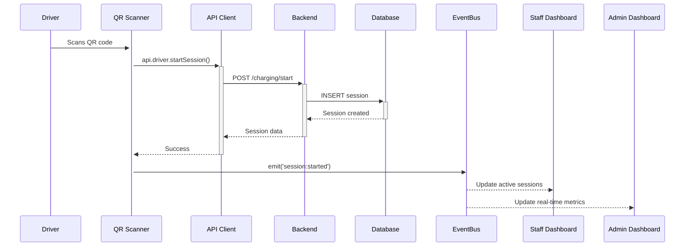
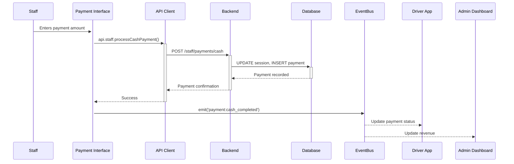
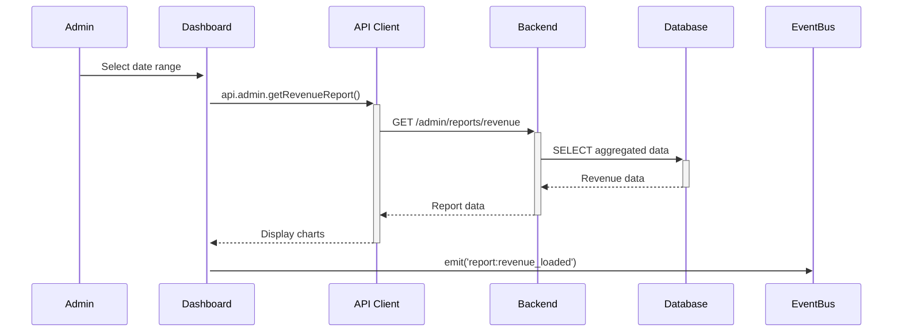

# Data Flow Integration Guide

## EV Charging Station Management System

**Date:** November 15, 2025  
**Version:** 1.0.0

---

## 📋 Overview

This document describes the data flow architecture ensuring proper communication between **Driver**, **Staff**, and **Admin** actors in the EV Charging Station Management System.

---

## 🏗️ Architecture

```
┌─────────────┐         ┌─────────────┐         ┌─────────────┐
│   DRIVER    │◄───────►│    STAFF    │◄───────►│    ADMIN    │
│  Frontend   │         │  Frontend   │         │  Frontend   │
└──────┬──────┘         └──────┬──────┘         └──────┬──────┘
       │                       │                        │
       │                       ▼                        │
       │              ┌─────────────────┐              │
       └─────────────►│   API CLIENT    │◄─────────────┘
                      │   (Centralized) │
                      └────────┬────────┘
                               │
                               ▼
                      ┌─────────────────┐
                      │  Spring Boot    │
                      │   Backend API   │
                      └────────┬────────┘
                               │
                               ▼
                      ┌─────────────────┐
                      │   SQL Server    │
                      │    Database     │
                      └─────────────────┘
```

---

## 📁 Core Files

### 1. **api-client.js**

Location: `front-end/client/src/js/api-client.js`

**Purpose:** Centralized API communication layer

**Key Features:**

- Automatic authentication token handling
- Error handling with 401/403 redirects
- Retry logic for network failures
- Type-safe API endpoints for each actor

**APIs Available:**

```javascript
// Driver APIs
api.driver.getProfile();
api.driver.updateProfile(data);
api.driver.getChargingHistory();
api.driver.startSession(chargerId, stationId);
api.driver.stopSession(sessionId);
api.driver.paySession(sessionId, paymentMethod);

// Staff APIs
api.staff.getAssignedStations();
api.staff.getActiveSessions(stationId);
api.staff.startSessionForDriver(driverId, chargerId);
api.staff.stopSessionForDriver(sessionId, reason);
api.staff.processCashPayment(sessionId, amount, notes);
api.staff.reportIncident(stationId, chargerId, type, description);

// Admin APIs
api.admin.getAllUsers(role, page, size);
api.admin.getAllStations(status);
api.admin.getRevenueReport(startDate, endDate, groupBy);
api.admin.getUsageReport(startDate, endDate, stationId);
api.admin.assignStaffToStation(staffId, stationId);
api.admin.assignIncident(incidentId, staffId);
api.admin.resolveIncident(incidentId, solution);
```

### 2. **data-flow.js**

Location: `front-end/client/src/js/data-flow.js`

**Purpose:** Manages data synchronization and event broadcasting between actors

**Key Components:**

#### **EventBus**

```javascript
import { eventBus } from "./data-flow.js";

// Subscribe to events
eventBus.on("session:started", (sessionData) => {
  console.log("New session started:", sessionData);
});

// Emit events
eventBus.emit("payment:completed", paymentData);
```

#### **SessionManager**

```javascript
import { sessionManager } from "./data-flow.js";

// Driver starts session
const session = await sessionManager.startDriverSession(chargerId, stationId);

// Staff monitors session
const sessionDetails = await sessionManager.getSessionForStaff(sessionId);

// Staff stops session
await sessionManager.staffStopSession(sessionId, "Emergency stop");
```

#### **PaymentManager**

```javascript
import { paymentManager } from "./data-flow.js";

// Driver online payment
await paymentManager.processOnlinePayment(sessionId, "credit_card");

// Staff cash payment
await paymentManager.processCashPayment(sessionId, 150000, "Cash received");
```

#### **IncidentManager**

```javascript
import { incidentManager } from "./data-flow.js";

// Staff reports incident
const incident = await incidentManager.reportIncident(
  stationId,
  chargerId,
  "CHARGER_ERROR",
  "Charger not responding",
  "HIGH"
);

// Admin assigns to staff
await incidentManager.assignIncident(incidentId, staffId);

// Admin resolves
await incidentManager.resolveIncident(incidentId, "Replaced faulty component");
```

---

## 🔄 Data Flow Scenarios

### Scenario 1: Driver Starts Charging Session



**Code Example:**

```javascript
// Driver's qr-scanner.html
import { sessionManager, showNotification } from "./data-flow.js";

async function startChargingSession(qrData) {
  try {
    const session = await sessionManager.startDriverSession(
      qrData.chargerId,
      qrData.stationId
    );

    showNotification("Phiên sạc đã bắt đầu!", "success");
    window.location.href = `charging-status.html?sessionId=${session.sessionId}`;
  } catch (error) {
    showNotification("Không thể bắt đầu sạc: " + error.message, "error");
  }
}
```

---

### Scenario 2: Staff Processes Cash Payment



**Code Example:**

```javascript
// Staff's payment interface
import { paymentManager, showNotification } from "./data-flow.js";

async function handleCashPayment(sessionId) {
  const amount = document.getElementById("paymentAmount").value;
  const notes = document.getElementById("paymentNotes").value;

  try {
    await paymentManager.processCashPayment(sessionId, amount, notes);
    showNotification("Thanh toán tiền mặt thành công", "success");

    // Refresh session list
    loadActiveSessions();
  } catch (error) {
    showNotification("Lỗi thanh toán: " + error.message, "error");
  }
}
```

---

### Scenario 3: Admin Views Reports



**Code Example:**

```javascript
// Admin's reports page
import { adminDashboard } from "./data-flow.js";

async function loadRevenueReport() {
  const startDate = document.getElementById("startDate").value;
  const endDate = document.getElementById("endDate").value;
  const groupBy = document.getElementById("groupBy").value; // day/week/month

  try {
    const report = await adminDashboard.getRevenueReport(
      startDate,
      endDate,
      groupBy
    );

    renderRevenueChart(report);
  } catch (error) {
    console.error("Error loading report:", error);
  }
}
```

---

## 🔔 Event System

### Available Events

| Event Name               | Triggered By | Subscribers   | Data Payload                                  |
| ------------------------ | ------------ | ------------- | --------------------------------------------- |
| `session:started`        | Driver       | Staff, Admin  | `{ sessionId, stationId, userId, startTime }` |
| `session:stopped`        | Driver/Staff | Driver, Admin | `{ sessionId, endTime, reason }`              |
| `session:updated`        | Real-time    | Driver, Staff | `{ sessionId, currentSOC, energyConsumed }`   |
| `payment:completed`      | Driver       | Staff, Admin  | `{ sessionId, amount, method, timestamp }`    |
| `payment:cash_completed` | Staff        | Admin         | `{ sessionId, amount, staffId }`              |
| `incident:reported`      | Staff        | Admin         | `{ incidentId, stationId, severity }`         |
| `incident:assigned`      | Admin        | Staff         | `{ incidentId, staffId }`                     |
| `incident:resolved`      | Admin        | Staff, Driver | `{ incidentId, solution }`                    |
| `station:updated`        | Real-time    | Staff, Admin  | `{ stationId, status, chargers[] }`           |
| `dashboard:updated`      | Real-time    | Admin         | `{ activeUsers, revenue, incidents }`         |

### Event Subscription Example

```javascript
import { eventBus } from "./data-flow.js";

// Staff monitoring interface
eventBus.on("session:started", (data) => {
  // Add new session to active list
  addSessionToList(data);
  showNotification(`Phiên sạc mới: ${data.sessionId}`, "info");
});

eventBus.on("incident:reported", (data) => {
  // Alert staff of new incident
  showIncidentAlert(data);
  playAlertSound();
});

// Cleanup on page unload
window.addEventListener("beforeunload", () => {
  eventBus.off("session:started", handleSessionStarted);
});
```

---

## 🔐 Authentication Flow

### Token Storage

```javascript
// On login success
localStorage.setItem("accessToken", response.accessToken);
localStorage.setItem("refreshToken", response.refreshToken);
localStorage.setItem("userRole", response.role);
localStorage.setItem("userId", response.userId);
localStorage.setItem("userName", response.name);
```

### Automatic Token Handling

```javascript
// api-client.js automatically adds token to requests
buildHeaders(includeAuth = true) {
    const headers = {
        'Content-Type': 'application/json'
    };

    if (includeAuth) {
        const token = this.getToken();
        if (token) {
            headers['Authorization'] = `Bearer ${token}`;
        }
    }

    return headers;
}
```

### 401 Handling

```javascript
// Automatic redirect on unauthorized
async handleResponse(response) {
    if (response.status === 401) {
        this.handleUnauthorized();
        throw new Error('Phiên đăng nhập hết hạn. Vui lòng đăng nhập lại.');
    }
    return await response.json();
}

handleUnauthorized() {
    localStorage.clear();
    window.location.href = `login.html?redirect=${encodeURIComponent(window.location.pathname)}`;
}
```

---

## 🧪 Testing Data Flow

### Mock Data for Development

While backend is being developed, use mock data:

```javascript
// In any API call
try {
  const data = await api.driver.getChargingHistory();
  displayHistory(data);
} catch (error) {
  console.warn("API unavailable, using mock data");
  displayHistory(generateMockData());
}

function generateMockData() {
  return [
    {
      sessionId: "SESSION-001",
      stationName: "Trạm Nguyễn Huệ",
      startTime: "2025-11-15T08:30:00Z",
      energyConsumed: 45.5,
      totalCost: 159250,
      status: "COMPLETED",
    },
  ];
}
```

---

## 📊 Real-time Updates

### WebSocket Connection

```javascript
import { RealtimeConnection } from "./api-client.js";

// Staff monitoring
const stationMonitor = new RealtimeConnection(
  "/ws/staff/station/STATION-001",
  (data) => {
    // Handle real-time updates
    updateStationStatus(data);
  },
  (error) => {
    console.error("WebSocket error:", error);
  }
);

stationMonitor.connect();

// Send commands
stationMonitor.send({
  action: "STOP_CHARGER",
  chargerId: "CHARGER-001",
  reason: "Emergency",
});

// Cleanup
window.addEventListener("beforeunload", () => {
  stationMonitor.disconnect();
});
```

### Polling Fallback

If WebSocket is not available:

```javascript
// Poll every 5 seconds
setInterval(async () => {
  try {
    const sessions = await api.staff.getActiveSessions(stationId);
    updateSessionsList(sessions);
  } catch (error) {
    console.error("Polling error:", error);
  }
}, 5000);
```

---

## 🚀 Migration Guide

### For Existing Pages

To migrate existing pages to use the new data flow:

1. **Add module imports to HTML:**

```html
<script type="module" src="./src/js/api-client.js"></script>
<script type="module" src="./src/js/data-flow.js"></script>
<script type="module" src="./your-page-script.js"></script>
```

2. **Update your JavaScript:**

```javascript
// OLD WAY
const response = await fetch(`${API_BASE_URL}/profile`, {
  headers: { Authorization: `Bearer ${token}` },
});
const data = await response.json();

// NEW WAY
import api from "./api-client.js";
const data = await api.driver.getProfile();
```

3. **Use event system:**

```javascript
import { eventBus, showNotification } from "./data-flow.js";

// Subscribe to events
eventBus.on("session:started", (data) => {
  showNotification("Phiên sạc đã bắt đầu!", "success");
});
```

---

## 📝 Best Practices

### 1. Always Use Centralized API Client

❌ **DON'T:**

```javascript
fetch('http://localhost:8080/api/profile', { ... })
```

✅ **DO:**

```javascript
import api from "./api-client.js";
await api.driver.getProfile();
```

### 2. Handle Errors Gracefully

```javascript
try {
  const data = await api.driver.getChargingHistory();
  displayHistory(data);
} catch (error) {
  showNotification("Không thể tải lịch sử: " + error.message, "error");
  // Optionally use mock data
  displayHistory(generateMockData());
}
```

### 3. Emit Events for Cross-Component Communication

```javascript
import { eventBus } from "./data-flow.js";

// After successful payment
eventBus.emit("payment:completed", {
  sessionId,
  amount,
  timestamp: new Date().toISOString(),
});
```

### 4. Use Managers for Complex Operations

```javascript
// Instead of direct API calls
import { sessionManager } from "./data-flow.js";
await sessionManager.startDriverSession(chargerId, stationId);
// This handles: API call + event emission + localStorage + error handling
```

### 5. Clean Up Resources

```javascript
// In components with WebSocket or intervals
window.addEventListener("beforeunload", () => {
  stationMonitor.stopMonitoring(stationId);
  clearInterval(pollingInterval);
});
```

---

## 🔍 Debugging

### Enable Debug Mode

```javascript
localStorage.setItem("debugMode", "true");
```

This will log all events to console:

```
[EventBus] session:started: { sessionId: 'SESSION-001', ... }
[EventBus] payment:completed: { sessionId: 'SESSION-001', ... }
```

### Check API Calls

Open browser DevTools → Network tab → Filter by "api"

### Inspect Events

```javascript
// See all registered listeners
console.log(eventBus.listeners);
```

---

## 📌 Summary

The data flow architecture ensures:

✅ **Consistent API calls** across all pages  
✅ **Automatic authentication** handling  
✅ **Real-time synchronization** between actors  
✅ **Event-driven communication** for loose coupling  
✅ **Error handling** with graceful fallbacks  
✅ **Type-safe endpoints** prevent mistakes  
✅ **Easy testing** with mock data support

---

## 📞 Support

For questions or issues with data flow integration, check:

- `api-client.js` for available APIs
- `data-flow.js` for event types
- Browser console for error messages
- Network tab for API call details

**Last Updated:** November 15, 2025  
**Version:** 1.0.0
